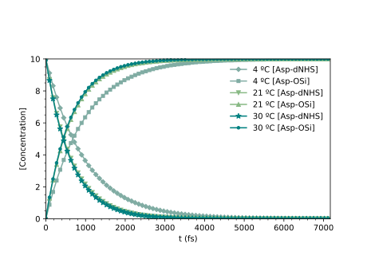

# kinetic-graph
Silly little program that converts kinetic data (simulated or not) into a graph showing the decay of reactant concentrations as product concentration increases over time.

### Required files (all in the same directory)
- Python file [kinetics.py](kinetics.py) (or jupyter notebook file [kinetics.ipynb](kinetics.ipynb))
- csv file with your own concentration (x) vs time (y) data:

|tAsp(fs)	      |4C[Asp-ONS]	    |4C[Asp-OSi]	  |21[Asp-ONS]	  | 21[Asp-OSi]	  | 30[Asp-ONS]	  | 30[Asp-OSi]   |
|:-------------:|:---------------:|:-------------:|:-------------:|:-------------:|:-------------:|:-------------:|
|0	            |10	              |0	            |10	            |0	            |10	            |0              |
|10	            |9.90E+00 	      |0.1	          |9.85E+00     	|0.15	          |9.84E+00	      |0.16           |
|20	            |9.80E+00	        |0.2	          |9.70E+00	      |0.3	          |9.69E+00	      |0.31           |
|30	            |9.70E+00	        |0.3	          |9.55E+00	      |0.45	          |9.53E+00	      |0.47           |
|...            |...    	        |...           	|...            |...            |...            |...            |

### Launch python program
- linux: `python3 kinetics.py`
- windows terminal (PowerShell): `python3 .\kinetics.py`

## Modeled reactant and product concentration vs. time plot 

